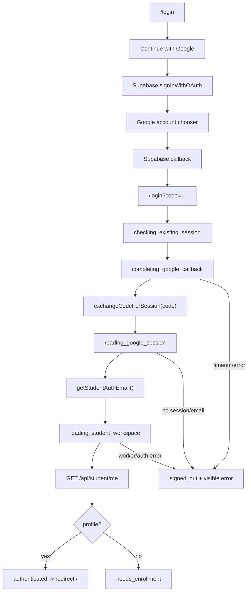

# Standard Student Login Workflow

This document is the canonical student login workflow for this project.

Follow this workflow exactly. Student login must use the Supabase Google OAuth redirect flow, manual PKCE callback completion, and Worker-backed student session resolution described here. Do not reintroduce Google Identity Services in-page button/popup logic unless this document is deliberately replaced by a tested migration plan.

## Critical Rules

- Student login starts from `/login` and uses `studentSupabase.auth.signInWithOAuth({ provider: "google" })`.
- The app must not load `gsi/client`, must not call `google.accounts.id.renderButton`, and must not require `VITE_GOOGLE_CLIENT_ID`.
- `detectSessionInUrl: false` is intentional. The app owns callback processing through `completeStudentAuthCallbackIfPresent(...)`.
- The callback URL must be `/login` or `/`, with `code`, hash tokens, or provider error markers.
- Local development must use the same browser origin from start to callback. The standard origin is `http://127.0.0.1:5173`.
- Do not switch between `localhost`, `127.0.0.1`, or a fallback Vite port during login. The PKCE verifier is origin-specific.
- `SessionProvider` must set `mountedRef.current = true` when its mount effect runs and `false` only in cleanup. This is required for React StrictMode recovery and timeout handling.
- Every long auth operation must have a visible stage and a timeout path. The UI must never look idle while auth is processing.

## Configuration Contract

Frontend:

- `frontend/.env`
  - `VITE_SUPABASE_URL`
  - `VITE_SUPABASE_ANON_KEY`
  - `VITE_WORKER_URL`
  - `VITE_BASE_PATH=/` for local `/login`
- `frontend/vite.config.ts`
  - dev server stays on port `5173`
  - `strictPort: true`

Supabase Auth:

- Google provider enabled with the Google OAuth Web client ID and secret.
- Redirect URLs include the actual app login URL, for local dev:
  - `http://127.0.0.1:5173/login`
- Site URL should match the deployed/local app origin.

Google Cloud OAuth:

- Authorized redirect URI includes the Supabase callback URL:
  - `https://<project-ref>.supabase.co/auth/v1/callback`
- Authorized JavaScript origins are not part of this app flow. This app does not use the GIS in-page origin check.

Worker:

- `VITE_WORKER_URL` points to the Worker API.
- Worker `ALLOWED_ORIGINS` includes the frontend origin.
- Worker Supabase JWT verification uses the same Supabase project as the frontend.

## Algorithm

1. `/login` renders `frontend/src/pages/Login.tsx`.
   - Reads `status`, `authStep`, `authEmail`, `authError`, `signInWithGoogle`, and `logout` from `useSession()`.
   - Shows a plain OAuth button.
   - Button disabled rule is only:
     ```tsx
     disabled={submitting || originBlocked}
     ```

2. User clicks `Continue with Google`.
   - `Login.handleSignIn()` sets `submitting=true`.
   - Calls `signInWithGoogle()` from `SessionProvider`.

3. `SessionProvider.signInWithGoogle()` calls `startStudentGoogleSignIn()`.
   - Imported as `signInStudentWithGoogle` from `frontend/src/lib/api.ts`.

4. `signInStudentWithGoogle()` validates local origin.
   - `assertSupportedLocalAuthOrigin()`
   - `redirectToCanonicalLocalLoginIfNeeded()`
   - If canonical redirect is needed, navigate to `http://127.0.0.1:5173/login?resetAuth=1` before OAuth starts.

5. `signInStudentWithGoogle()` starts Supabase OAuth.
   ```ts
   studentSupabase.auth.signInWithOAuth({
     provider: "google",
     options: {
       redirectTo: resolveAppUrl("login"),
       queryParams: { prompt: "select_account" }
     }
   })
   ```
   - Success is a full-page navigation away from the app.
   - Code after the await only matters for startup errors.

6. Google account chooser runs outside the app.
   - User selects the school Google account.
   - Google redirects to Supabase Auth.
   - Supabase redirects back to the app.

7. Browser returns to the app.
   - Expected URL shape:
     - `/login?code=...&state=...` for PKCE code flow
     - `/login#access_token=...&refresh_token=...` for hash token fallback
     - `/login?error=...` for provider errors

8. `SessionProvider.refresh()` runs.
   - Captures:
     ```ts
     const authCallbackSnapshot = getCurrentAuthCallbackSnapshot();
     const isStudentCallback = isStudentAuthCallbackSnapshot(authCallbackSnapshot);
     ```
   - Sets `authStep` to `checking_existing_session`.
   - If callback markers exist, sets `authStep` to `completing_google_callback`.

9. Callback completion runs with timeout.
   ```ts
   await withTimeout(
     completeStudentAuthCallbackIfPresent(authCallbackSnapshot),
     BOOTSTRAP_TIMEOUT_MS,
     "Google sign-in timed out"
   );
   ```
   - This timeout is mandatory.
   - If it fires, the login page must leave `Completing Google sign-in.` and show a visible error.

10. `completeStudentAuthCallbackIfPresent(snapshot)` checks whether the callback is actionable.
    - Valid paths: `/login`, `/`
    - Valid signals: `code`, hash token, or provider error.
    - Non-student routes must not process student callbacks.

11. `completeStudentAuthCallback()` handles provider errors first.
    - Reads `error`, `error_code`, and `error_description`.
    - Clears callback URL markers.
    - Throws a visible error.

12. For normal PKCE callback, `completeStudentAuthCallback()` reads:
    ```ts
    const code = url.searchParams.get("code");
    ```
    Then calls:
    ```ts
    exchangeStudentCodeForSession(code)
    ```

13. `exchangeStudentCodeForSession(code)` reads:
    ```ts
    alt-assessment.student-auth-code-verifier
    ```
    - Missing verifier means the browser changed origin/profile/storage or stale auth state was reset.
    - Missing verifier must throw visible recovery guidance.

14. `exchangeStudentCodeForSession(code)` calls Supabase:
    ```ts
    studentSupabase.auth.exchangeCodeForSession(code)
    ```
    - This exchanges `code + PKCE verifier` for a Supabase session.
    - The stored session key is:
      ```ts
      alt-assessment.student-auth
      ```

15. Callback URL markers are cleared with `history.replaceState`.
    - `code`, `state`, `error`, `error_code`, `error_description`, and hash tokens must not remain in the address bar.

16. `SessionProvider.refresh()` moves to `reading_google_session`.
    - Calls `getStudentAuthEmail()`.
    - Reads the session from the completed callback, stored Supabase auth state, or valid fallback.
    - Rejects anonymous sessions and sessions without an email.

17. `SessionProvider.refresh()` moves to `loading_student_workspace`.
    - Calls `getStudentSession()`.
    - This calls `GET <VITE_WORKER_URL>/api/student/me`.
    - Request includes:
      ```http
      Authorization: Bearer <supabase_access_token>
      ```

18. Worker verifies the Supabase JWT.
    - `requireUser(request, env)` validates issuer, audience, subject, and role.
    - `requireStudentAuth(auth)` rejects anonymous/no-email auth.

19. Worker resolves the student workspace.
    - `studentSession(db, userId, email)`
    - Loads existing profile by Supabase user ID.
    - If no profile exists, attempts roster auto-enrollment by Google email.
    - Returns:
      - `profile`
      - `courses`
      - `enrollmentStatus`

20. Frontend applies the terminal state.
    - `profile` present: `status="authenticated"`, cache session, redirect `/login` to `/`.
    - No profile: `status="needs_enrollment"`, show signed-in email and enrollment message.
    - Auth/Worker failure: `status="signed_out"` with visible error.

21. Protected student routes render only after `status="authenticated"`.
    - `StudentProtectedLayout` gates routes.
    - Dashboard reads `courses` and `assignments` from `useSession()`.

## State Machine



## Required UI Stages

The login page must map auth steps to visible status text:

- `checking_existing_session`: `Checking for an existing student session.`
- `completing_google_callback`: `Completing Google sign-in.`
- `reading_google_session`: `Reading Google session.`
- `loading_student_workspace`: `Loading student workspace.`
- `resetting`: `Resetting sign-in.`

These messages are not decoration. They are operational diagnostics. If login fails, the visible stage identifies the failing subsystem.

## Required Recovery Behavior

- `Reset sign-in` must call `logout()`.
- `logout()` must enter `resetting`, then call `applySignedOut()`.
- `applySignedOut()` must clear:
  - Supabase student auth storage
  - `alt-assessment.student-auth-code-verifier`
  - in-memory callback completion state
  - cached student session
- A timed-out callback must leave `completing_google_callback` and show `Google sign-in timed out`.
- React StrictMode must not break recovery. `mountedRef.current` must be restored to `true` in the provider mount effect setup.

## Test Guardrails

The frontend tests must keep these invariants:

- Login page uses `signInWithGoogle`.
- Login page does not import/load GIS.
- Login button is not disabled by `status === "checking"`.
- `SessionState` exposes `authStep`.
- `completeStudentAuthCallbackIfPresent(authCallbackSnapshot)` is wrapped in `withTimeout(...)`.
- `mountedRef.current = true` exists in the mount effect before cleanup sets it to `false`.
- `authErrorRef` must not return. Fresh checks must not preserve stale auth errors.
- Student and teacher Supabase storage keys stay distinct.
- `detectSessionInUrl` stays `false`.

Run these checks after any login-related change:

```bash
npm run typecheck --workspace frontend
npm run test --workspace frontend
npm run build --workspace frontend
```

## Troubleshooting By Visible Stage

### Stuck at `Completing Google sign-in.`

The app received a callback and is processing Supabase PKCE exchange.

Check:

- Network request to `/auth/v1/token?grant_type=pkce`
- `alt-assessment.student-auth-code-verifier` exists before exchange
- `mountedRef.current` setup/cleanup guard is intact
- after 20 seconds, timeout shows `Google sign-in timed out`

### Stuck at `Reading Google session.`

Supabase callback completed, but the app cannot read a valid Google-backed Supabase session.

Check:

- `alt-assessment.student-auth` exists and has an unexpired access token
- token/session includes an email
- session is not anonymous

### Stuck at `Loading student workspace.`

Supabase auth is valid, but Worker/student resolution is failing.

Check:

- Worker is running at `VITE_WORKER_URL`
- Worker `ALLOWED_ORIGINS` includes frontend origin
- `/api/student/me` receives `Authorization: Bearer <token>`
- roster email matches the selected Google account

## Do Not Change Without A Replacement Plan

Do not change these without a complete migration plan and updated tests:

- Supabase OAuth redirect flow
- manual callback completion
- student storage key `alt-assessment.student-auth`
- PKCE verifier handling
- auth-step UI diagnostics
- React StrictMode mounted-ref recovery
- Worker JWT verification before student profile lookup
